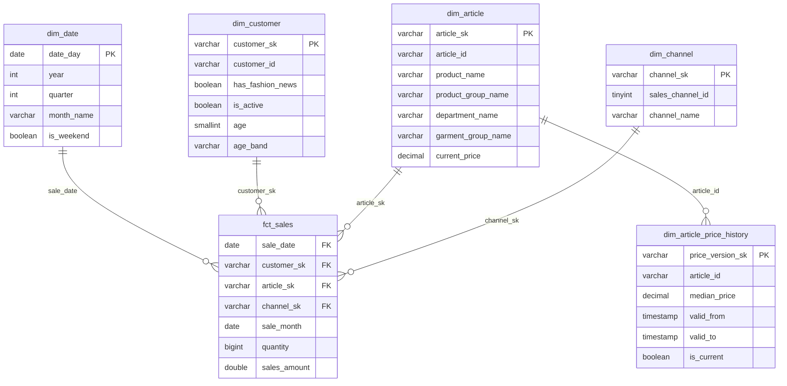

# hm_retail_analytics

[](https://github.com/alexeyserdtse/hm_retail_analytics/actions/workflows/ci.yml)
[](https://www.python.org/)
[](https://docs.getdbt.com/)
[](https://duckdb.org/)
[](https://sqlfluff.com/)
[](LICENSE)

Dimensional warehouse over the [H&M fashion dataset](https://www.kaggle.com/competitions/h-and-m-personalized-fashion-recommendations):
31.8M transactions across 25 months, modeled as a Kimball star with SCD2 price
history. dbt on DuckDB, orchestrated by Airflow (Astro runtime).

## Quickstart

0. **Prerequisites:** git, make, unzip, and Python 3.12.

   *Ubuntu/Debian:*

   ```bash
   sudo apt-get install -y git make unzip
   sudo add-apt-repository ppa:deadsnakes/ppa && sudo apt-get update && sudo apt-get install -y python3.12 python3.12-venv
   ```

   *macOS* (with [Homebrew](https://brew.sh); make ships with the Xcode command-line tools):

   ```bash
   xcode-select --install
   brew install git python@3.12
   ```

   *Windows:* use [WSL2](https://learn.microsoft.com/windows/wsl/install)
   (`wsl --install` in an admin PowerShell, then Ubuntu from the Microsoft
   Store) and follow the Ubuntu steps inside it — the Makefile assumes a
   POSIX shell. Docker Desktop integrates with WSL2 for the Airflow part.

   (Any other way of getting a 3.12 interpreter — uv, pyenv, conda — works the
   same; `make setup` only needs `python3.12` on PATH.)

1. **Kaggle access** (one-time): create a [Kaggle](https://www.kaggle.com) account,
   accept the [competition rules](https://www.kaggle.com/competitions/h-and-m-personalized-fashion-recommendations/rules),
   then Kaggle → Settings → API → *Create New Token* and place the file:

   ```bash
   mkdir -p ~/.kaggle && mv ~/Downloads/kaggle.json ~/.kaggle/ && chmod 600 ~/.kaggle/kaggle.json
   ```

2. **Clone:**

   ```bash
   git clone https://github.com/alexeyserdtse/hm_retail_analytics.git
   cd hm_retail_analytics
   ```

3. **Build the warehouse** (~3.5 GB download, a few minutes to load):

   ```bash
   make quickstart        # venv + download + load + dbt build + tests
   ```

   The result is `dev.duckdb` at the repo root — open it with any DuckDB client.

4. **Orchestration (optional):** install [Docker](https://docs.docker.com/engine/install/)
   and the [Astro CLI](https://www.astronomer.io/docs/astro/cli/install-cli), then:

   ```bash
   make up                # airflow at http://localhost:8080
   ```

5. In the Airflow UI, unpause `hm_ingestion` and `dbt_job` — catchup replays all
   25 months through the ingestion → dbt pipeline, and the SCD2 price history
   builds up month by month.

## Architecture

```
Kaggle CSVs ──► parquet ──► loader ──► raw ──► stg ──► dwh
 (3.5 GB)      (one-time)   (python)   └──────── dbt ───────┘
```

| Layer | Responsibility | Materialization |
|---|---|---|
| `raw` | source definitions + thin views over the landing tables | view |
| `stg` | rename, cast, clean — 1:1 with raw, no joins | view |
| `dwh` | business-facing star schema | table |



`dim_article_price_history` is the SCD2 output of `snap_article_price`
(dbt snapshot over the raw layer); `is_current` marks each article's open row.

`fct_sales` is incremental (delete+insert by month; grain: date × customer ×
article × channel). `snap_article_price` tracks monthly median price per
article — it reads only the raw layer and only `dim_article` consumes it,
which keeps the dbt graph acyclic.

## Data

The dataset comes from H&M Group's 2022 Kaggle competition: real (anonymized)
e-commerce and store sales from hm.com, published to build recommendation
systems. Three files matter here:

| File | Rows | Contents |
|---|---|---|
| `transactions_train.csv` | 31.8M | one row per item purchased: date, customer, article, price, channel (2018-09-20 → 2020-09-22) |
| `articles.csv` | 105k | product catalog: merchandise hierarchy, garment group, color, department |
| `customers.csv` | 1.4M | customer attributes: age, club membership, fashion-news subscription |

The competition also ships ~25 GB of product images — irrelevant for a
warehouse and skipped by the per-file download below.

The dataset (~3.5 GB, three CSVs) is competition-licensed and never enters the
repo. With Kaggle access in place (Quickstart step 1), make fetches everything:

```bash
make data
```

or do it by hand — download each file from the
[data tab](https://www.kaggle.com/competitions/h-and-m-personalized-fashion-recommendations/data)
([transactions_train.csv](https://www.kaggle.com/competitions/h-and-m-personalized-fashion-recommendations/data?select=transactions_train.csv),
[articles.csv](https://www.kaggle.com/competitions/h-and-m-personalized-fashion-recommendations/data?select=articles.csv),
[customers.csv](https://www.kaggle.com/competitions/h-and-m-personalized-fashion-recommendations/data?select=customers.csv))
into `include/data/raw/`, or use the kaggle CLI directly:

```bash
cd include/data/raw
kaggle competitions download -c h-and-m-personalized-fashion-recommendations -f transactions_train.csv
kaggle competitions download -c h-and-m-personalized-fashion-recommendations -f articles.csv
kaggle competitions download -c h-and-m-personalized-fashion-recommendations -f customers.csv
unzip -o '*.zip' && rm -f *.zip && cd ../../..
```

Then convert once to Parquet (skip if you used `make data` — it already did):

```bash
python include/scripts/csv_to_parquet.py
```

IDs are kept as text on purpose: `article_id` carries leading zeros and
`customer_id` is a hex string — numeric inference would mangle both.

## Loading

The loader owns the physical `raw.*` tables in `dev.duckdb` (repo root,
gitignored). Dimensions are replaced whole; transactions load month by month
with delete+insert, so any month can be rerun safely — the property Airflow
backfills will rely on. Every attempt is audited in `raw.load_log`. DuckDB
allows a single writer: disconnect other clients before loading or building.

```bash
python include/scripts/loader.py --history      # dims + all 25 months
python include/scripts/loader.py --month 2019-01
```

## Building

```bash
cd include/hm_dwh
dbt build          # seeds, snapshot, models, tests — dependency order
dbt build --select stg                                   # one layer
dbt run --select fct_sales --vars '{month: "2019-01"}'   # rebuild one month
```

Packages: [dbt_utils](https://hub.getdbt.com/dbt-labs/dbt_utils/latest/) (date
spine, surrogate keys), [dbt_expectations](https://hub.getdbt.com/metaplane/dbt_expectations/latest/)
(distribution tests), [dbt_project_evaluator](https://hub.getdbt.com/dbt-labs/dbt_project_evaluator/latest/)
(structure lint, zero warnings), [codegen](https://hub.getdbt.com/dbt-labs/codegen/latest/)
(yml scaffolding).

Modeling calls made from profiling the raw data: repeat purchase rows are kept
and counted into `quantity` (they are real repeat purchases, not duplicates);
`FN`/`Active` nulls mean "not opted in"; articles that never sold carry a null
`current_price` by design.

## Quality gates

```bash
python -m pytest                     # loader + converter tests
sqlfluff lint include/hm_dwh
```

CI runs pytest, `dbt parse`, and sqlfluff on every PR. `master` is protected:
merge requires a pull request and a green check, admins included. Every
workflow command lives in the [Makefile](Makefile) — `make help` lists them.

## License

MIT — see [LICENSE](LICENSE). The H&M dataset itself remains under Kaggle's
competition terms.
