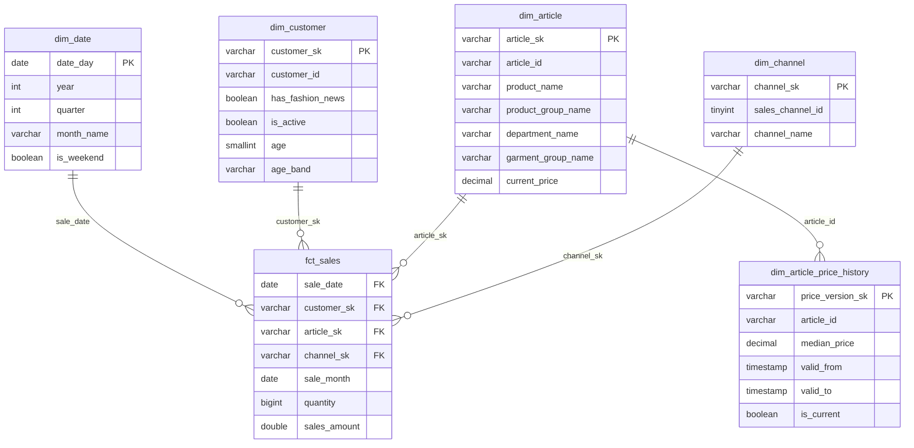

# hm_retail_analytics

[](https://github.com/alexeyserdtse/hm_retail_analytics/actions/workflows/ci.yml)
[](https://www.python.org/)
[](https://docs.getdbt.com/)
[](https://duckdb.org/)
[](https://sqlfluff.com/)
[](LICENSE)

Dimensional warehouse over the [H&M fashion dataset](https://www.kaggle.com/competitions/h-and-m-personalized-fashion-recommendations):
31.8M transactions across 25 months, modeled as a Kimball star with SCD2 price
history. dbt on DuckDB; Airflow orchestration is the next milestone.

## Architecture

```
Kaggle CSVs ──► parquet ──► loader ──► raw ──► stg ──► dwh
 (3.5 GB)      (one-time)   (python)   └──────── dbt ───────┘
```

| Layer | Responsibility | Materialization |
|---|---|---|
| `raw` | source definitions + thin views over the landing tables | view |
| `stg` | rename, cast, clean — 1:1 with raw, no joins | view |
| `dwh` | business-facing star schema | table |



`dim_article_price_history` is the SCD2 output of `snap_article_price`
(dbt snapshot over the raw layer); `is_current` marks each article's open row.

`fct_sales` is incremental (delete+insert by month; grain: date × customer ×
article × channel). `snap_article_price` tracks monthly median price per
article — it reads only the raw layer and only `dim_article` consumes it,
which keeps the dbt graph acyclic.

## Setup

```bash
python3.12 -m venv .venv && source .venv/bin/activate
pip install dbt-duckdb duckdb pytest sqlfluff sqlfluff-templater-dbt
cd include/hm_dwh && dbt deps && cd ../..
export HM_DB_PATH="$PWD/dev.duckdb"
python -m pytest
```

## Data

The dataset comes from H&M Group's 2022 Kaggle competition: real (anonymized)
e-commerce and store sales from hm.com, published to build recommendation
systems. Three files matter here:

| File | Rows | Contents |
|---|---|---|
| `transactions_train.csv` | 31.8M | one row per item purchased: date, customer, article, price, channel (2018-09-20 → 2020-09-22) |
| `articles.csv` | 105k | product catalog: merchandise hierarchy, garment group, color, department |
| `customers.csv` | 1.4M | customer attributes: age, club membership, fashion-news subscription |

The competition also ships ~25 GB of product images — irrelevant for a
warehouse and skipped by the per-file download below.

The dataset (~3.5 GB, three CSVs) is competition-licensed and never enters the
repo. Download `transactions_train.csv`, `articles.csv` and `customers.csv`
from Kaggle (accept the competition rules first) into `include/data/raw/`,
then convert them once to Parquet:

```bash
python include/scripts/csv_to_parquet.py
```

IDs are kept as text on purpose: `article_id` carries leading zeros and
`customer_id` is a hex string — numeric inference would mangle both.

## Loading

The loader owns the physical `raw.*` tables in `dev.duckdb` (repo root,
gitignored). Dimensions are replaced whole; transactions load month by month
with delete+insert, so any month can be rerun safely — the property Airflow
backfills will rely on. Every attempt is audited in `raw.load_log`. DuckDB
allows a single writer: disconnect other clients before loading or building.

```bash
python include/scripts/loader.py --history      # dims + all 25 months
python include/scripts/loader.py --month 2019-01
```

## Building

```bash
cd include/hm_dwh
dbt build          # seeds, snapshot, models, tests — dependency order
dbt build --select stg                                   # one layer
dbt run --select fct_sales --vars '{month: "2019-01"}'   # rebuild one month
```

Packages: [dbt_utils](https://hub.getdbt.com/dbt-labs/dbt_utils/latest/) (date
spine, surrogate keys), [dbt_expectations](https://hub.getdbt.com/metaplane/dbt_expectations/latest/)
(distribution tests), [dbt_project_evaluator](https://hub.getdbt.com/dbt-labs/dbt_project_evaluator/latest/)
(structure lint, zero warnings), [codegen](https://hub.getdbt.com/dbt-labs/codegen/latest/)
(yml scaffolding).

Modeling calls made from profiling the raw data: repeat purchase rows are kept
and counted into `quantity` (they are real repeat purchases, not duplicates);
`FN`/`Active` nulls mean "not opted in"; articles that never sold carry a null
`current_price` by design.

## Quality gates

```bash
python -m pytest                     # loader + converter tests
sqlfluff lint include/hm_dwh
```

CI runs pytest, `dbt parse`, and sqlfluff on every PR. `master` is protected:
merge requires a pull request and a green check, admins included.

## License

MIT — see [LICENSE](LICENSE). The H&M dataset itself remains under Kaggle's
competition terms.
